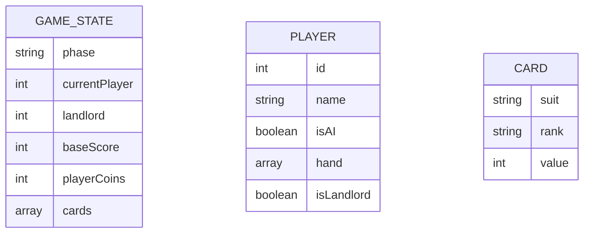

## 1. Architecture Design
```mermaid
graph TB
    A[用户界面层] --&gt; B[游戏逻辑层]
    B --&gt; C[数据状态层]
    D[AI决策层] --&gt; B
```

## 2. Technology Description
- Frontend: React@18 + TypeScript + tailwindcss@3 + vite
- Initialization Tool: vite-init
- Backend: None（纯前端游戏）
- Database: None（本地状态管理）
- 状态管理: zustand

## 3. Route Definitions
| Route | Purpose |
|-------|---------|
| / | 游戏主页面 |

## 4. API Definitions (if backend exists)
本项目为纯前端游戏，无需后端API。

## 5. Server Architecture Diagram (if backend exists)
本项目为纯前端游戏，无服务器架构。

## 6. Data Model (if applicable)
### 6.1 Data Model Definition


### 6.2 Data Definition Language
本项目使用本地状态管理，无需数据库。
